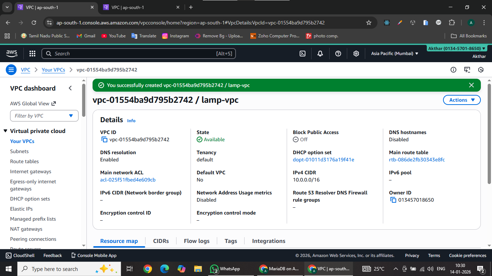
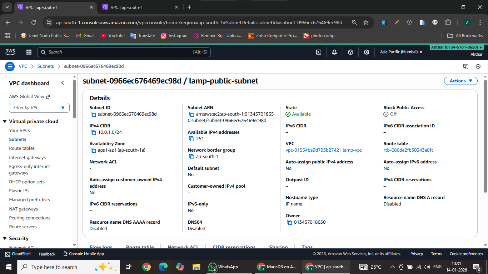
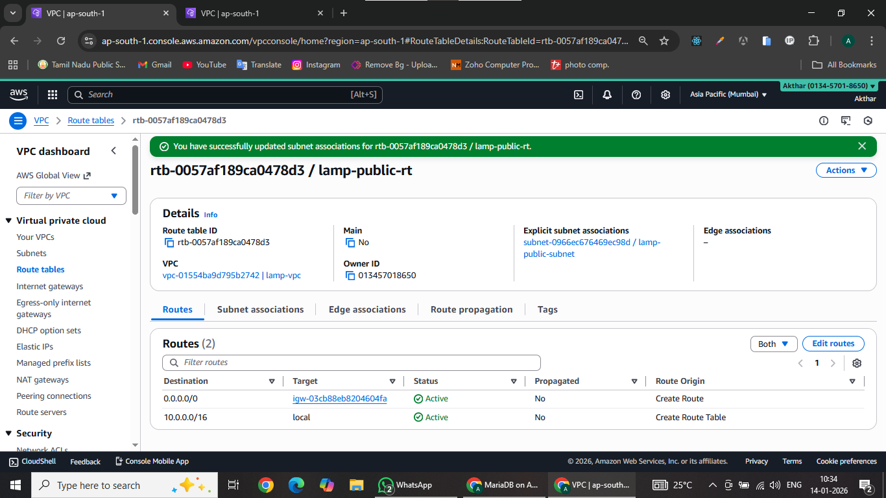
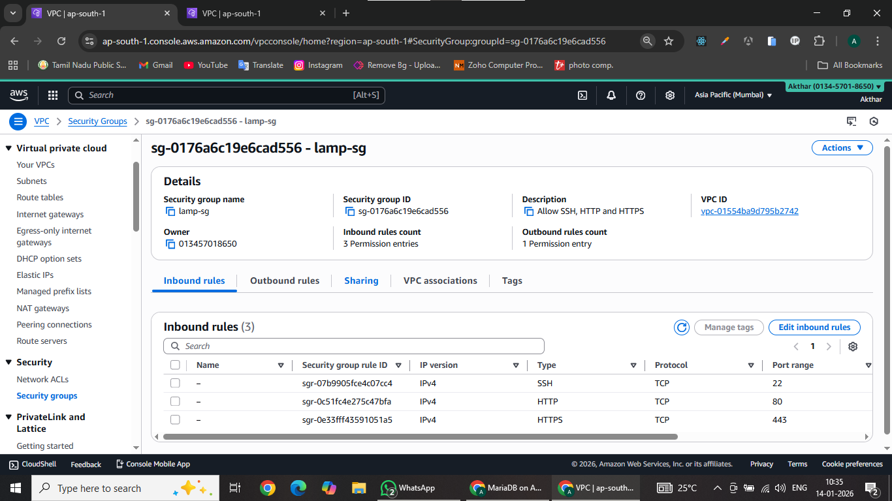
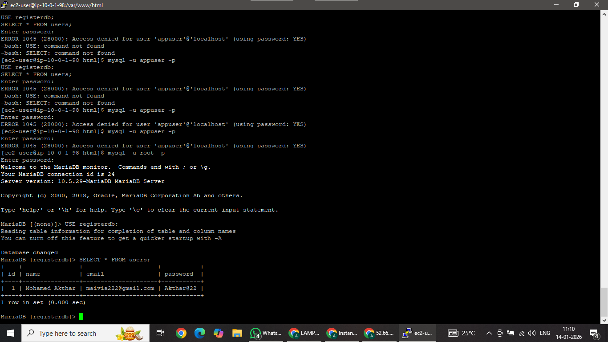

# Secure LAMP Stack Registration Application on AWS (VPC + EC2 + MariaDB + PHP)

---

## 🎯 Objective
  `To deploy a fully functional LAMP stack web application on AWS using EC2 and a custom VPC, and to store user registration data in MariaDB through a PHP backend.`

---

## 📌 Services Used

    * **AWS VPC** – Custom isolated network
    * **EC2 (Amazon Linux 2023)** – Application server
    * **Apache (httpd)** – Web server
    * **PHP** – Backend logic
    * **MariaDB** – Relational database
    * **HTML5 & CSS3** – Responsive frontend

---

## 🏗 Architecture Overview

```
      Client
     (Browser)
        |
     Internet
        |
 ┌───────────────┐
 │ Internet GW   |
 └──────┬────────┘
        |
 ┌───────────────┐
 │ Public Subnet │→ (10.0.1.0/24)
 └──────┬────────┘
        |
 ┌──────────────┐
 │ EC2 Instance │→ Apache Web Server
 │ Amazon Linux │
 └──────┬───────┘
        |
 ┌──────────────┐
 │     PhP      |→ 
 └──────┬───────┘
        |
 ┌──────────────┐
 │   MariaDB    │→ Store Values
 │   Database   │
 └──────────────┘

```

---

## 🚀 Step-by-Step Implementation

---

## ⭐ STEP-1 Create VPC

- Go to AWS Console → **VPC**

#### Create VPC

     - Name: lamp-vpc
     - IPv4 CIDR: 10.0.0.0/16

#### Create Public Subnet

     - Name: lamp-public-subnet
     - CIDR: 10.0.1.0/24
     - AZ: ap-south-1
     - Auto-assign public IP → ENABLE

#### Create Internet Gateway

     - Name: lamp-igw
     - Attach to **lamp-vpc**

#### Create Route Table

     - Name: lamp-public-rt
     - Route → 0.0.0.0/0 → internet gateway \* Subnet association → public subnet

#### Create Security Group

     - Name: lamp-sg \* Attach to **lamp-vpc**
     - Inbound Rules: SSH, HTTP and HTTPS

---

## ⭐ STEP-2 Launch EC2

- AWS Console → EC2 → Launch Instance

#### Launch EC2 Instances

     - Name: lamp-server
     - OS: Amazon Linux 2
     - Instance type: t2.micro
     - Network: lamp-vpc
     - Subnet: lamp-public-subnet-a
     - Auto-public IP: ENABLE
     - Security Group: Choose Existing Security Group

   # ==> `Launch Instances` <==

---


# ⭐ STEP-3 Install Apache Web Server

- Copy Public IP → Go to Putty tool → Open the Linux Shell

      sudo dnf install httpd -y
      sudo systemctl start httpd
      sudo systemctl enable httpd

✅ **Output:**

```
Apache web page loads successfully at http://52.66.211.43(Example)
```

---

## ⭐ Step-4 Install PHP

      sudo dnf install php php-mysqlnd -y
      sudo systemctl restart httpd

Test PHP:

      sudo nano /var/www/html/info.php
      <?php phpinfo(); ?>

✅ **Output:**

  => http://52.66.211.43/info.php


---

## ⭐ Step-5 Install & Configure MariaDB

      sudo dnf install mariadb105-server -y
      sudo systemctl start mariadb
      sudo systemctl enable mariadb

  ### Secure DB:

      sudo mysql_secure_installation

  ✔ Set root password
  ✔ Remove anonymous users
  ✔ Remove test DB
  ✔ Reload privileges


==> Secure installation completed. <==

## ⭐ Step-6 Create database and table:

      mysql -u root -p

      CREATE DATABASE registerdb;
      USE registerdb;
      
      CREATE TABLE users (
        id INT AUTO_INCREMENT PRIMARY KEY,
        name VARCHAR(100),
        email VARCHAR(100),
        password VARCHAR(100)
      );

      EXIT;


✅ **Output:**

==> Query OK, table created successfully <==

---

## ⭐ Step-7 Create Database User(If You Face any Error Use This Query)

      CREATE USER 'appuser'@'localhost' IDENTIFIED BY 'App@123';
      GRANT ALL PRIVILEGES ON registerdb.* TO 'appuser'@'localhost';
      FLUSH PRIVILEGES;

✅ **Output:**

==> User created and privileges granted <==

---

## ⭐ Step-8 Frontend – Registration Page

### index.html

       sudo nano /var/www/html/index.html

        <!DOCTYPE html>
        <html>
        <head>
          <title>Register</title>
          <link rel="stylesheet" href="style.css">
        </head>
        <body>
        
        <div class="container">
          <h2>Register</h2>
          <form action="register.php" method="post">
            <input type="text" name="name" placeholder="Name" required>
            <input type="email" name="email" placeholder="Email" required>
            <input type="password" name="password" placeholder="Password" required>
            <button type="submit">Register</button>
          </form>
        </div>
        
        </body>
        </html>

 ### style.css

        sudo nano /var/www/html/style.css

        body {
          font-family: Arial;
          background: #f4f4f4;
        }
        
        .container {
          width: 100%;
          max-width: 400px;
          background: white;
          padding: 20px;
          margin: 100px auto;
          border-radius: 10px;
        }
        
        input, button {
          width: 100%;
          padding: 10px;
          margin-top: 10px;
        }
        
        button {
          background: #007bff;
          color: white;
          border: none;
          cursor: pointer;
        }
        
        @media (max-width: 600px) {
          .container {
            margin: 50px 10px;
          }
        }

  ### register.php

       sudo nano /var/www/html/register.php

       <?php
        $conn = new mysqli("localhost", "appuser", "App@123", "registerdb");
        
        if ($conn->connect_error) {
            die("DB Error: " . $conn->connect_error);
        }
        
        $name = $_POST['name'];
        $email = $_POST['email'];
        $password = $_POST['password'];
        
        $stmt = $conn->prepare(
          "INSERT INTO users (name, email, password) VALUES (?, ?, ?)"
        );
        $stmt->bind_param("sss", $name, $email, $password);
        
        if ($stmt->execute()) {
            echo "✅ Registration successful";
        } else {
            echo "❌ Insert failed";
        }
        
        $stmt->close();
        $conn->close();
        ?>
        

* Responsive registration form
* Fields: Name, Email, Password
* PHP Form Handling

---

## ⭐ STEP-9 Fix Permissions
      sudo chown -R apache:apache /var/www/html
      sudo chmod -R 755 /var/www/html
      sudo systemctl restart httpd

---

## ⭐ STEP-10 Test Again

Open:

==> http://52.66.211.43/index.html <==


  ==> ✔ Submit the Button <==

  ✅ **Output after submission:**

```
Registration successful
```

## ⭐ STEP-11 Check the DB:

      mysql -u root -p
      USE registerdb;
      SELECT * FROM users;
      
------------ Or -------------

      mysql -u appuser -p
      USE registerdb;
      SELECT * FROM users;

✔ Data should appear

✅ **Output:**

      +----+-----------------+------------------------+----------+
      | id | name            | email                  | password |
      +----+-------=========-+------------------------+----------+
      |  1 | Mohamed Akthar  | maivia222@gmail.com    | *****    |
      +----+-----------------+------------------------+----------+

---

## 📸 Screenshots

### VPC Settings



### Subnet Setup



### Internet Gateway


### Route Table



### Security Group



### EC2 Page


## Public IP Output


### PHP Testing Page UI


### Success Response


### Linux Shell DB Output


